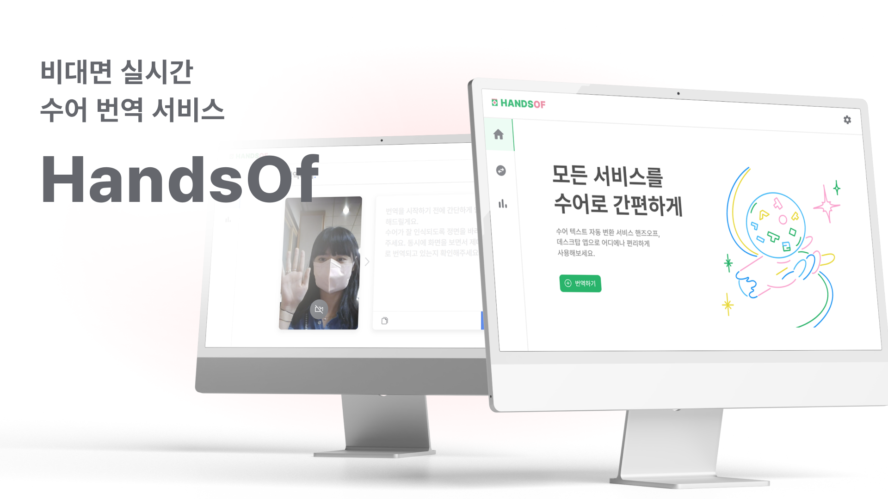
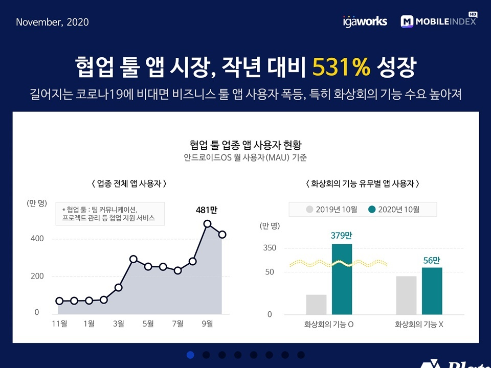
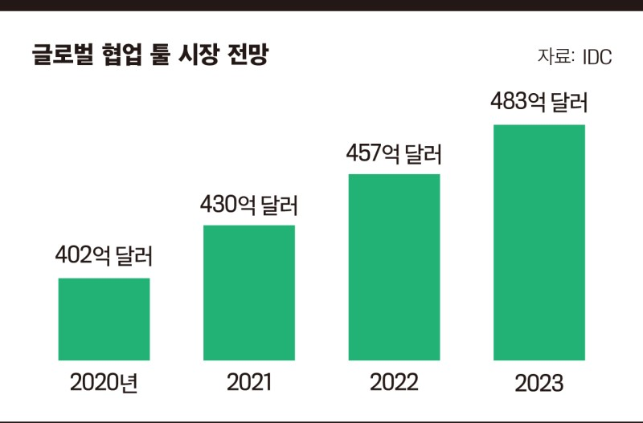
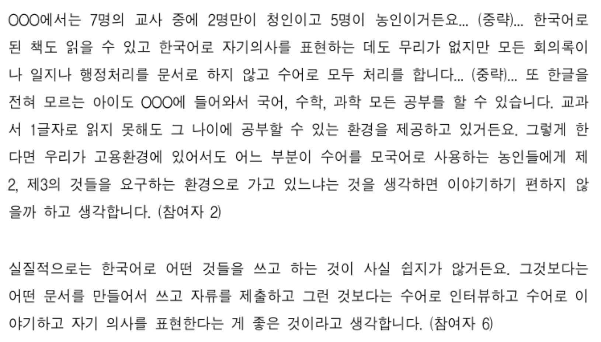
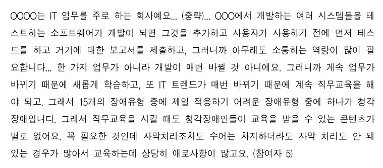
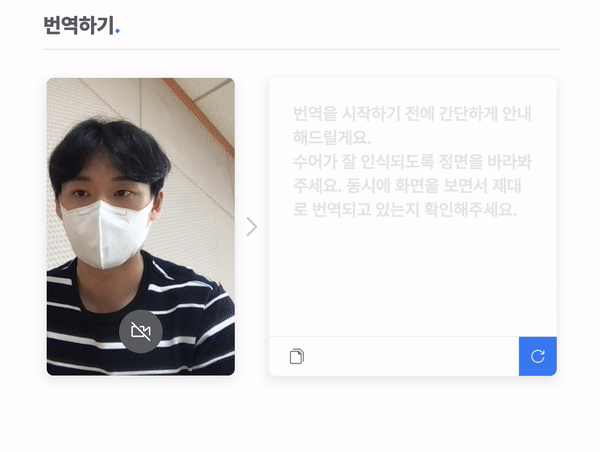
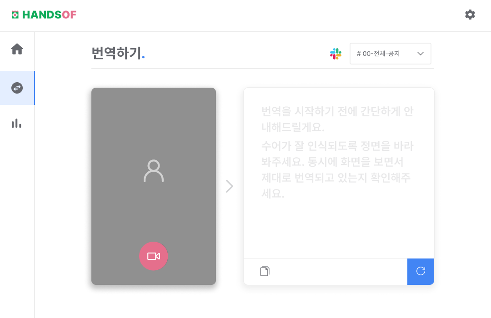
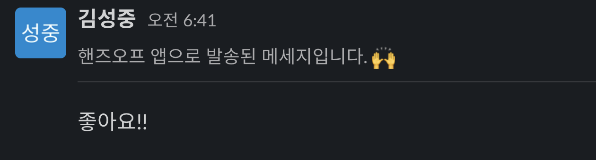

> 본 프로젝트는 2022년 07월 23일 토요일부터 07월 24일 일요일까지 한국외국어대학교 AI 교육원, GDSC HUFS, 그리고 TAB에서 주최하여 진행한 제 1회 HUFSummer Hackathon 출품작입니다.

## 목차 :books:

- [도입 :tada: ](#도입-tada)
  - [팀 소개](#팀-소개)
  - [포스트 코로나 시기의 현황](#포스트-코로나-시기의-현황)
  - [청각장애인 분들의 상황](#청각장애인-분들의-상황)
  - [핸즈오프 서비스](#핸즈오프-서비스)
- [설계 :rocket:](#설계-rocket)
  - [디자인](#디자인)
  - [프론트엔드](#프론트엔드)
  - [백엔드](#백엔드)
  - [머신러닝](#머신러닝)
- [To-do :white_check_mark:](#to-do-white_check_mark)
- [라이선스 :scroll:](#라이선스-scroll)

### 도입 :tada:

#### 팀 소개

안녕하세요! 문제를 찾아 마법처럼 해결하는 **팀 훕커스 포커스**입니다.

저희는 디자이너 1명, 프론트엔드 1명, 백엔드 1명, 머신러닝 1명으로 구성되어 있습니다.

각 팀원에 대한 정보는 아래 이미지 혹은 텍스트를 클릭하여 확인 가능합니다.

<table>
<tr>
    <td align="center"><a href="https://github.com/jangjia01234"> <b>디자이너 : 장지아</b></a></td>
    <td align="center"><a href="https://github.com/joseph-106"> <b>프론트엔드 : 김성중</b></a></td>
    <td align="center"><a href="https://github.com/hgene0929"> <b>백엔드 : 이현진</b></a></td>         
    <td align="center"><a href="https://github.com/0417taehyun"> <b>머신러닝 : 이태현</b></a></td>

</tr>
</table>

#### 포스트 코로나 시기의 현황

2019년 12월 대유행하기 시작한 코로나는 어느덧 포스트 코로나 시기를 맞이했습니다.

그러나 다시는 코로나 이전의 일상으로 돌아갈 수 없다는 전문가들의 의견처럼 우리의 일상은 많이 바뀌었습니다.

그 중 대표적인 것이 바로 **재택 근무** 혹은 **비대면 수업**과 더불어 성장한 **협업 툴** 사용입니다.

2020년 기준 2019년 대비 약 530% 성장, 향후 글로벌 협업 툴 시장의 전망이 약 480억 달러에 달한다는 아래 두 통계자료만 보더라도 그 규모가 얼마나 대단했는지 알 수 있습니다.

출처 : [모바일 협업 툴 시장 ‘531%’ 성장…압도적 1위는 ‘줌’](https://platum.kr/archives/151840)

출처 : [Worldwide Collaborative Applications Forecast, 2021–2025](https://www.idc.com/getdoc.jsp?containerId=US48061821)

이처럼 다시는 코로나 이전으로 돌아갈 수 없는, 협업 툴 시대의 호황을 맞이하고 있는 지금 시대에 소외받고 있는 사람들은 과연 누구일까요?

바로 **청각장애인** 분들입니다.

### 청각장애인 분들의 상황

2022년 4월 통계청에서 발표한 자료에 따르면 청각장애인 수는 전체 장애인 수 중 2위에 위치할 정도로 많습니다.

점차 늘어나는 비대면 환경과 함께 많은 수의 청각장애인 분들이 어려움을 겪는 것은 당연합니다.

텍스트를 활용해서 충분히 소통할 수 있는 것이 아닌 지에 대한 의문이 들 수 있습니다.

하지만 아래 두 인터뷰 결과를 보면 청각장애인 분들이 사용하는 언어인 수어와 한국어는 완전히 다르다고 할 수 있으며 이런 상황 속에서 많은 청각장애인 분들이 비장애인 분들과 함께 일하면서 수어를 사용할 수 없는 상황에 많은 어려움을 겪는다는 걸 알 수 있습니다.

출처 : [청각장애인 고용차별 및 고용개선방안 실태조사 수어환경을 중심으로](https://www.dbpia.co.kr/journal/articleDetail?nodeId=NODE09364756)

출처 : [청각장애인 고용차별 및 고용개선방안 실태조사 수어환경을 중심으로](https://www.dbpia.co.kr/journal/articleDetail?nodeId=NODE09364756)

기존에도 부족한 수어 통역사와 사회적 인식으로 인해 어려움을 겪던 청각장애인 분들은 협업 툴의 호황 속에서 모순적이게도 점점 더 어려운 상황에 처하게 되었습니다.

그리고 저희는 그들의 어려움을 해결해주기 위해 실시간으로 수어를 번역해 원하는 협업 툴에 메세지를 전송할 수 있게 도와주는 서비스 **핸즈오프**를 기획 및 개발하게 되었습니다.

#### 핸즈오프 서비스

핸즈오프 서비스는 모든 서비스를 수어로 간편하게 이용할 수 있게 돕는 서비스입니다.

사용자는 핸즈오프 서비스를 통해 본인의 수어를 실시간으로 번역해서 원하는 협업 툴에 메세지를 전송할 수 있습니다.

실시간으로 번역되는 수어 예시는 아래와 같습니다.

#### 구현 기능

구현된 기능은 아래와 같습니다.

- :sparkles: Slack 연동 기능
- :sparkles: 수어 실시간 번역 기능
- :sparkles: 본인이 전송한 메세지 조회 기능
- :sparkles: 메시지 전송이 가능한 Slack 채널 조회 기능
- :sparkles: 메시지 전송이 가능한 Slack 사용자 조회 기능
- :sparkles: Slack 내 특정 채널 및 사용자에게 메세지 전송 기능

### 설계 :rocket:

#### 디자인

> 더 자세한 UI 작업물은 [피그마](https://www.figma.com/file/eNANuNZkiBfo0qw6KuEROU/Hufsummer-Hackathon_220723?node-id=40%3A7915)에서 확인 가능합니다.

텍스트에 어려움을 느끼는 청각장애인 분들의 원활한 서비스 사용을 위해 직관적인 아이콘 및 시각적 기표를 사용하여 그들의 사용자 경험, 다시 말해 UX(User Experience)를 개선하려 노력했습니다.

예를 들어 아래 번역하기 부분을 보면 메세지를 전송하고자 하는 플랫폼을 아이콘으로 대체하였으며 카메라 전원이나 번역된 메세지 새로 생성 등 많은 부분을 아이콘으로 대체한 것을 알 수 있습니다.

#### 프론트엔드

> 더 자세한 소스코드는 [FRONTEND 디렉토리](https://github.com/GDSCXTAB-HUFSummer-Hackathon/04_HUFcusFocus_Handsof/tree/main/FRONTEND) 파일에서 확인 가능합니다.

사용한 기술 스택은 아래와 같습니다.

- Electron
- ReactJS
- TypeScript
- styled-components
- GitHub Actions
- AWS : S3, CloudFront, Certificate Manager, Route 53

#### 백엔드

> 더 자세한 소스코드는 [BACKEND 디렉토리](https://github.com/GDSCXTAB-HUFSummer-Hackathon/04_HUFcusFocus_Handsof/tree/main/BACKEND) 파일에서 확인 가능합니다.

사용한 기술 스택은 아래와 같습니다.

- Spring
- MongoDB
- AWS : EC2, Route 53
- Nginx

#### 머신러닝

> 더 자세한 소스코드는 [ML 디렉토리](https://github.com/GDSCXTAB-HUFSummer-Hackathon/04_HUFcusFocus_Handsof/tree/main/ML) 파일에서 확인 가능합니다.

사용한 기술 스택은 아래와 같습니다.

- FastAPI
- MongoDB
- Slack API
- AWS : EC2, S3, Route 53
- Nginx
- ReactJS
- TensorflowJS

특히 Slack API를 활용한 메세지 전송의 경우 오번역된 경우 등에 대한 송수신 사용자 양방향 인지를 위해 핸즈오프 서비스를 통해 전송된 메세지임을 알려주는 헤더를 추가했습니다.

### To do :white_check_mark:

추후 구현해야 할 사항은 아래와 같습니다.

- :white_check_mark: 텍스트를 수어로 번역해서 보여주는 기능
- :white_check_mark: Slack 외의 다른 협업 툴 통합 및 채팅 기능
- :white_check_mark: 더 많은 수어 모델 학습을 통한 풍부한 표현 기능
- :white_check_mark: 소셜 로그인 등을 추가한 로그인 / 회원가입 기능

### 라이선스 :scroll:

[MIT 라이선스](./LICENSE)를 준수합니다.
